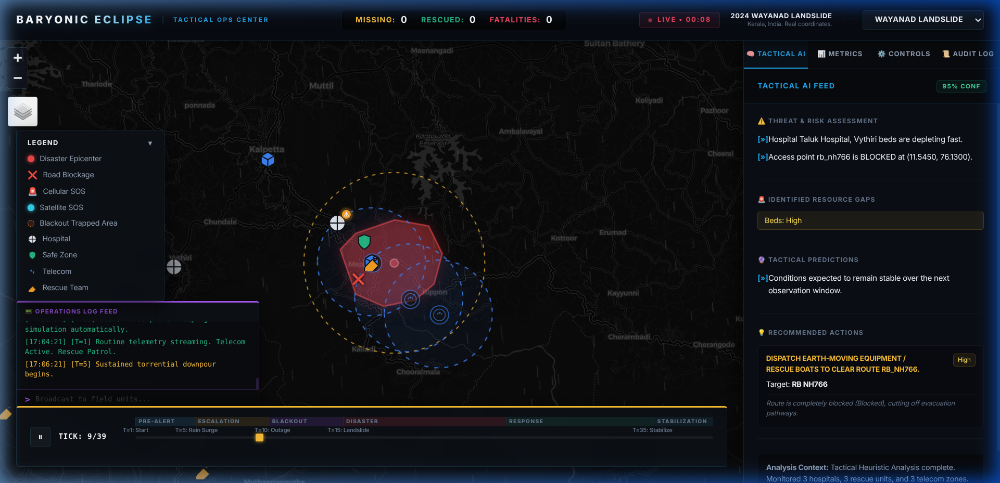
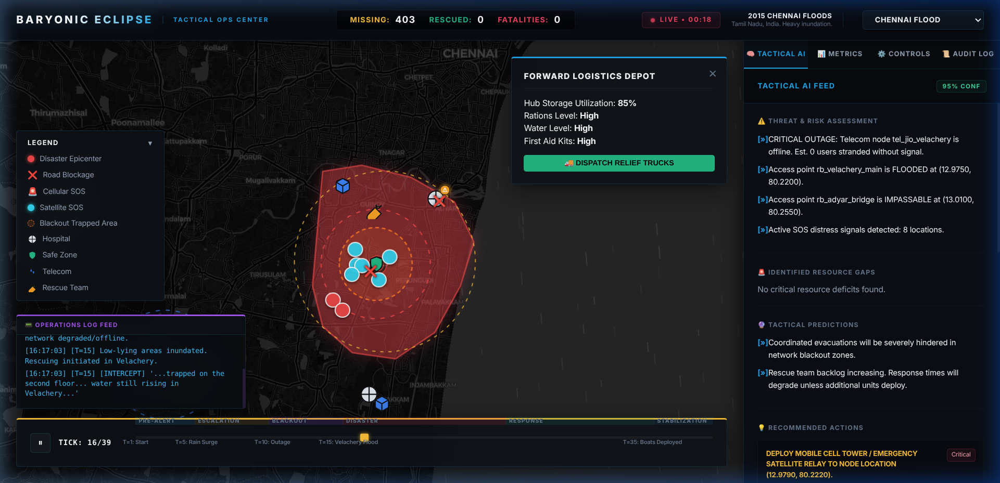
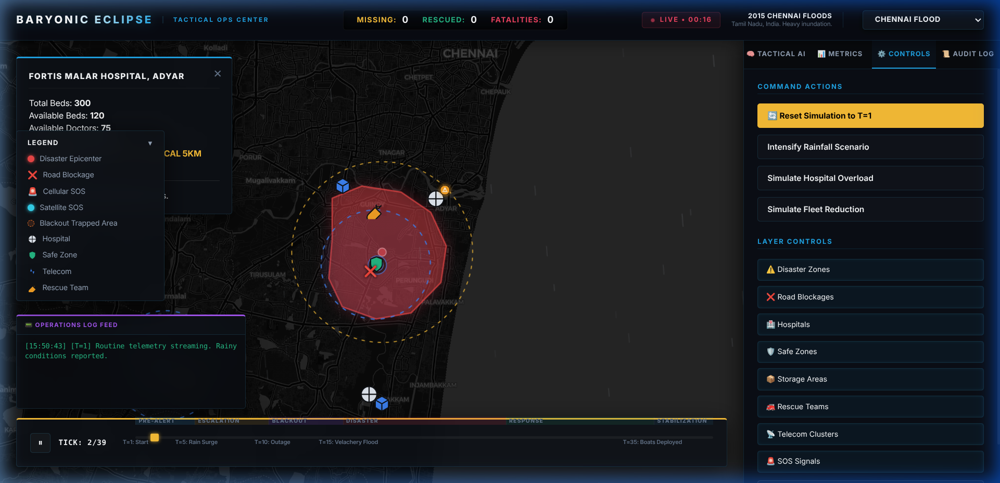

# 🛰️ Baryonic Eclipse — AI-Powered Disaster Command & Control System

<div align="center">


**A real-time, high-fidelity Tactical Command & Control dashboard for disaster response operations.**

*Built for the NDRF. Designed for reality.*

</div>

---

## 🧭 Overview

**Baryonic Eclipse** is a prototype **Disaster Management Command & Control (C2) System** designed to give government and emergency response agencies a single, unified operational interface during a live crisis. 

Inspired by real-world tragedies — the **Wayanad Landslides (July 2024)** and the **2015 Chennai Floods** — the system simulates how an administrator would monitor, coordinate, and respond to a disaster in real-time. Every feature was designed with a single principle: *decision speed saves lives.*

The application is built on a **Python WebSocket backend** driving a **live GIS map interface** powered by Leaflet.js, with **Google Gemini AI** providing tactical recommendations, threat assessments, and resource gap analysis on every simulation tick.

---

## ✨ Key Features

### 🗺️ Real-Time Tactical Map
- **Multi-Layer GIS Mapping** using Leaflet.js with 3 switchable base maps:
  - `Tactical Dark Mode` — Cyber-military aesthetic for ops-room use.
  - `Real-Time Satellite Imagery` — Live Esri/Arcgis satellite view for ground-truth verification.
  - `Standard Street Map` — OpenStreetMap for road navigation and routing.
- Dynamic disaster zone polygon rendering with risk-severity color coding.
- Hospital markers, safe zone clusters, telecom nodes, and logistics hubs — all live and interactive.

### 🚨 SOS Signal Management
- Real-time SOS beacon tracking — distinguishes between **Cellular SOS** and **Satellite SOS** (from offline telecom blackout zones).
- Priority score-based beacon sizing — the most critical signals are visually the largest on the map.
- **Dispatch Route Visualization** — when a rescue team is assigned to an SOS, a dashed polyline draws on the map showing the route with a live **ETA tooltip** (distance + estimated arrival time in minutes and ticks).
- Only **available (non-busy) rescue teams** are shown when assigning a team to a distress signal.

### 🤖 AI Tactical Analysis (Gemini 2.5 Flash)
- On every simulation tick, the current state is sent to the **Gemini AI API** for deep tactical analysis.
- The `Tactical AI` panel displays structured output including:
  - **Threat & Risk Assessment** (e.g., *"Telecom node offline, 0 users stranded without signal"*).
  - **Identified Resource Gaps** (hospital bed shortfalls, logistics deficits).
  - **Tactical Predictions** (e.g., *"Rescue team backlog will degrade if no additional units deploy"*).
  - **Recommended Actions** with severity tags (Critical / High / Medium).
- Graceful fallback engine handles API rate-limits — the system stays live even when the AI is unavailable.

### 🤖 AI Auto-Pilot Delegation Mode
- Toggle the **AI Auto-Pilot** switch in the Controls tab.
- When enabled, the system automatically executes high-confidence AI recommendations (e.g., auto-restocking logistics hubs below 50% capacity).
- All auto-executed actions are logged in the **Decision Audit Log** for accountability.

### 📡 Ground-Truth Comms Terminal
- An **Operations Log Terminal** displays all simulation events as a live feed.
- Administrators can **broadcast secure field commands** by typing in the comms input bar and pressing Enter.
- Messages are transmitted via WebSocket to the backend and logged into the simulation events feed.

### 📋 Decision Audit Log
- Every administrative action (dispatch, restock, broadcast) is time-stamped and persisted in browser `localStorage`.
- The audit log ensures full **accountability and replay capability** for post-disaster review.

### ⏱️ Simulation Timeline Scrubber
- A bottom timeline bar with phase blocks (`Pre-Alert`, `Escalation`, `Blackout`, `Disaster`, `Response`, `Stabilization`).
- Drag the scrubber to **jump to any point in time** and observe how the scenario state evolves.
- Play/Pause button for controlled observation.

---

## 🖼️ Screenshots

> **Note for Contributors:** Add your screenshots to a `/screenshots` folder and update the paths below.

| Dashboard — Wayanad Scenario | Dashboard — Chennai Satellite View |
|---|---|
|  |  |

| Entity Inspector Panel | Decision Audit Log |
|---|---|
|  |  |

---

## 🏗️ Architecture

```
┌─────────────────────────────────────────────────────────────┐
│                      FRONTEND (Browser)                      │
│  ┌───────────────────┐   ┌──────────────────────────────┐   │
│  │   Leaflet.js Map   │   │  Dashboard (HTML/CSS/JS)     │   │
│  │  (GIS Rendering)  │   │  - Tactical AI Panel         │   │
│  │                   │   │  - Metrics Tab               │   │
│  │  - SOS Markers    │   │  - Controls & Layer Toggles  │   │
│  │  - Disaster Zones │   │  - Decision Audit Log        │   │
│  │  - Dispatch Lines │   │  - Comms Terminal            │   │
│  └─────────┬─────────┘   └──────────────┬───────────────┘   │
│            └──────────────┬─────────────┘                    │
└───────────────────────────┼─────────────────────────────────┘
                            │ WebSocket (ws://)
                            │ JSON State Broadcast
┌───────────────────────────┼─────────────────────────────────┐
│                      BACKEND (Python)                        │
│  ┌────────────────────────▼───────────────────────────────┐ │
│  │                  FastAPI + Uvicorn                     │ │
│  │              WebSocket Server (main.py)                │ │
│  └───────────┬───────────────────┬────────────────────────┘ │
│              │                   │                           │
│  ┌───────────▼──────┐  ┌─────────▼────────────────────────┐ │
│  │  Simulation      │  │        AI Engine                 │ │
│  │  Engine          │  │   (ai_engine.py)                 │ │
│  │  (simulation.py) │  │                                  │ │
│  │                  │  │  - Sends state to Gemini API     │ │
│  │  - Tick Engine   │  │  - Receives structured JSON      │ │
│  │  - State Manager │  │  - Fallback mock engine          │ │
│  │  - Event Logger  │  │                                  │ │
│  └──────────────────┘  └──────────────────────────────────┘ │
└─────────────────────────────────────────────────────────────┘
```

---

## 📁 Project Structure

```
baryonic-eclipse/
├── backend/
│   ├── main.py            # FastAPI app, WebSocket server, action handlers
│   ├── models.py          # All Pydantic data schemas (SimulationState, Hospital, etc.)
│   ├── simulation.py      # Scripted disaster simulation engine (Wayanad + Chennai)
│   └── ai_engine.py       # Gemini API client with structured output & fallback
├── frontend/
│   ├── index.html         # Full dashboard UI layout with all panels
│   ├── styles.css         # Cyber-military dark theme, glassmorphism, animations
│   └── app.js             # Leaflet.js map controller, WebSocket client, all UI logic
├── .env                   # Local environment config (NOT committed to Git)
├── .env.example           # Template for environment variables
├── .gitignore
├── requirements.txt
└── README.md
```

---

## 🚀 Getting Started

### Prerequisites
- **Python 3.10+**
- A **Google Gemini API Key** (Free tier available — [Get one here](https://aistudio.google.com/apikey))

### 1. Clone the Repository
```bash
git clone https://github.com/your-username/baryonic-eclipse.git
cd baryonic-eclipse
```

### 2. Create a Virtual Environment (Recommended)
```bash
python -m venv .venv
source .venv/bin/activate    # On Linux/macOS
# .venv\Scripts\activate     # On Windows
```

### 3. Install Dependencies
```bash
pip install -r requirements.txt
```

### 4. Configure Environment Variables
Create a `.env` file in the root of the `baryonic-eclipse/` folder:
```env
GEMINI_API_KEY="your_gemini_api_key_here"
```

> ⚠️ **IMPORTANT:** The `.env` file is listed in `.gitignore` and will **never** be uploaded to GitHub. Your API key is safe. If you do not have a Gemini API key, the system will fall back to a local mock AI engine automatically.

### 5. Run the Server
```bash
python backend/main.py
```

Or using uvicorn directly:
```bash
uvicorn backend.main:app --host 0.0.0.0 --port 8000 --reload
```

### 6. Open the Dashboard
Navigate to **`http://localhost:8000`** in your browser.

---

## 🎮 How to Use

| Action | How |
|--------|-----|
| **Switch Scenario** | Use the top-right dropdown (Wayanad / Chennai Flood) |
| **Toggle Map Layers** | Use the layer control in the top-left corner of the map |
| **Inspect an Asset** | Click any marker on the map to open the Inspector Panel |
| **Dispatch Rescue Team** | Click an SOS marker → Select team → Click Assign |
| **Restock Logistics Hub** | Click a blue storage marker → Click "DISPATCH RELIEF TRUCKS" |
| **Enable AI Auto-Pilot** | Controls tab → Click "🤖 ENABLE AI AUTO-PILOT" |
| **Broadcast to Field** | Type in the Comms Terminal input at the bottom-left → Press Enter |
| **Jump in Time** | Drag the bottom timeline scrubber to any tick |

---

## 🌐 API Integration (Extending to Real-Time)

The system is designed to be API-ready. Replace the simulation engine with live data feeds:

### Real Hospital Data (Overpass API — Free, No Key Required)
```python
import requests

def fetch_real_hospitals(center_lat, center_lng, radius_meters=10000):
    query = f"""
    [out:json];
    node["amenity"="hospital"](around:{radius_meters},{center_lat},{center_lng});
    out;
    """
    response = requests.post("http://overpass-api.de/api/interpreter", data={'data': query})
    return response.json().get('elements', [])
```

### Live Weather / Flood Data
- **IMD (India Meteorological Department):** `https://mausam.imd.gov.in/` — district-level rainfall APIs.
- **OpenWeatherMap:** `https://openweathermap.org/api` — real-time precipitation data.

### Live SOS Integration
- Integrate with the **112 India Emergency API** or a custom mobile SOS app that POSTs GPS coordinates to your `/sos` endpoint.

---

## 🗺️ Scenarios

### 🌧️ Scenario 1: Wayanad Landslides (July 2024, Kerala)
- **Epicenter:** Chooralmala-Mundakkai region
- **39-tick scripted simulation** spanning Pre-Alert → Stabilization phases
- Assets: WIMS Hospital, Kalpetta Government Hospital, NDRF staging teams, Meppadi forward base

### 🌊 Scenario 2: 2015 Chennai Floods (Tamil Nadu)
- **Epicenter:** Velachery, South Chennai (Chembarambakkam river overflow simulation)
- Dynamic flood expansion, Chembarambakkam reservoir gate opening event
- **Real Government Hospitals:** Government Hospital Guindy + Royapettah Government Hospital
- Telecom blackout zone simulation (Jio Velachery offline)

---

## 🔮 Future Scope

- [ ] **Live IoT Telemetry Integration** — Ingest real flood sensors from IoT hardware deployed on dams and bridges.
- [ ] **Role-Based Access Control** — Separate dashboards for Dispatchers, Logistics Commanders, and Field Supervisors.
- [ ] **Pathfinding & Routing** — OpenRouteService API integration to calculate real road-avoiding routes for dispatched teams.
- [ ] **Mobile SOS Application** — Companion app for civilians to send GPS-tagged distress signals directly to the C2 dashboard.
- [ ] **Scenario Replay Mode** — Replay any saved audit log as a timestamped simulation for post-event analysis.
- [ ] **Multi-Tenant Support** — Multiple simultaneous disaster scenarios running in parallel across different states.

---

## 🛠️ Tech Stack

| Layer | Technology |
|-------|------------|
| **Backend Framework** | FastAPI (Python) |
| **Real-Time Communication** | WebSockets (native browser API + Python `websockets`) |
| **AI Engine** | Google Gemini 2.5 Flash (structured JSON output) |
| **Data Validation** | Pydantic v2 |
| **GIS Mapping** | Leaflet.js v1.9.4 |
| **Base Map Tiles** | CartoDB Dark Matter / Esri World Imagery / OpenStreetMap |
| **Satellite Map** | Esri ArcGIS World Imagery (free tiles) |
| **Frontend** | Vanilla HTML5, CSS3 (Glassmorphism), JavaScript (ES6+) |
| **Fonts** | Inter (Google Fonts) |
| **Server** | Uvicorn (ASGI) |

---

## 🔒 Security & API Key Safety

> **Your Gemini API key is never exposed in this repository.**

- The `.env` file containing your key is explicitly excluded by `.gitignore`.
- The frontend never directly calls any external API — all AI calls are proxied through the Python backend.
- If you fork this repo, create your own `.env` file with your own key.

---

## 📄 License

This project is open-source and available under the **MIT License**.

---

## 🤝 Acknowledgements

- Concept conceived during a college hackathon exploring *tech-for-good* applications in disaster management.
- Inspired by the tragic events of the **Wayanad Landslides (July 2024)** and the **2015 Chennai Floods**.
- Built with the belief that the right technology, in the right hands, can meaningfully accelerate emergency response.

---

<div align="center">

**Built with purpose. Designed for urgency. Engineered for impact.**

⭐ If you find this project impressive, please consider starring the repository!

</div>
